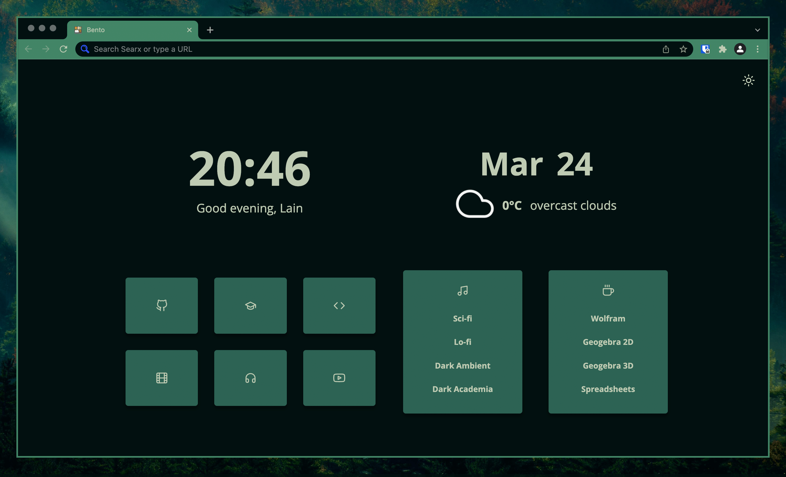

# Chromium pywal theme generator

Generates [pywal](https://github.com/dylanaraps/pywal) theme for Chromium

## Usage

1. Run script `./generate-theme.sh`
2. Open chromium
3. Go to `chrome://extensions`
4. Turn on "Developer Mode" in the top right corner
5. Press "Load unpacked"
6. Select "Pywal" (by default) in the same folder with the script
7. ???
8. PROFIT!

However, you need to run this script and restart chromium each time you change pywal colors (or reload extension manually, since there is no way to do it automatically).
So, make an alias or something like that.
But you don't need to repeat the steps above, just run the script and that's it, chromium will update theme colors automatically. 😁

